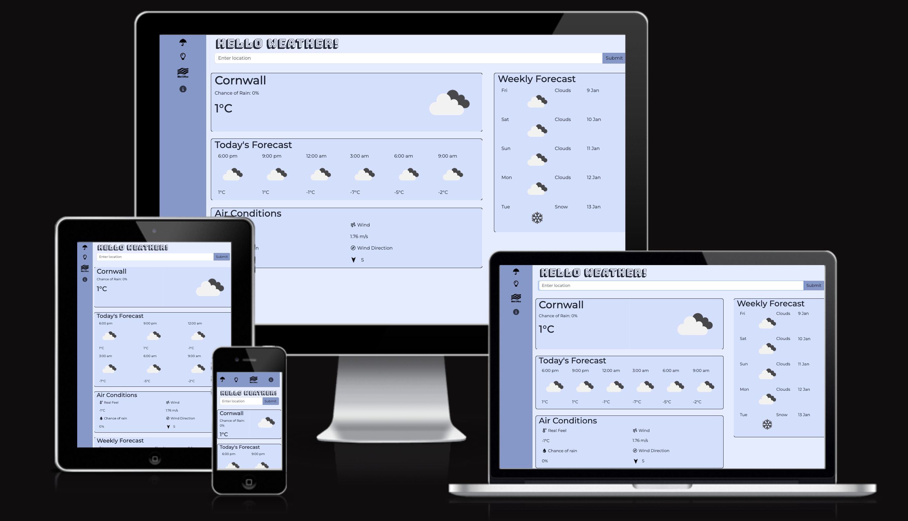
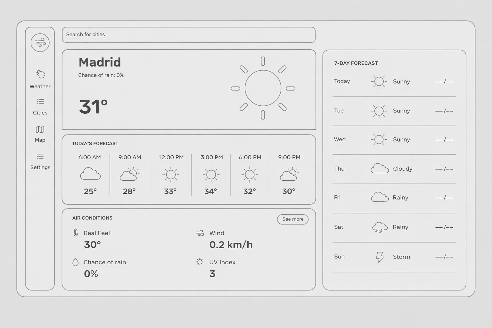
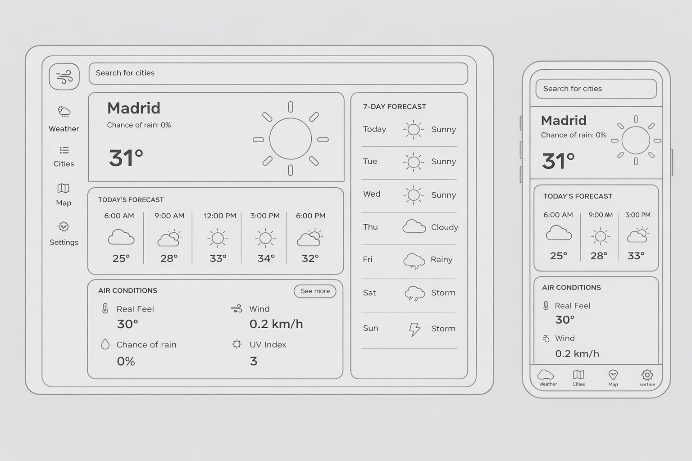
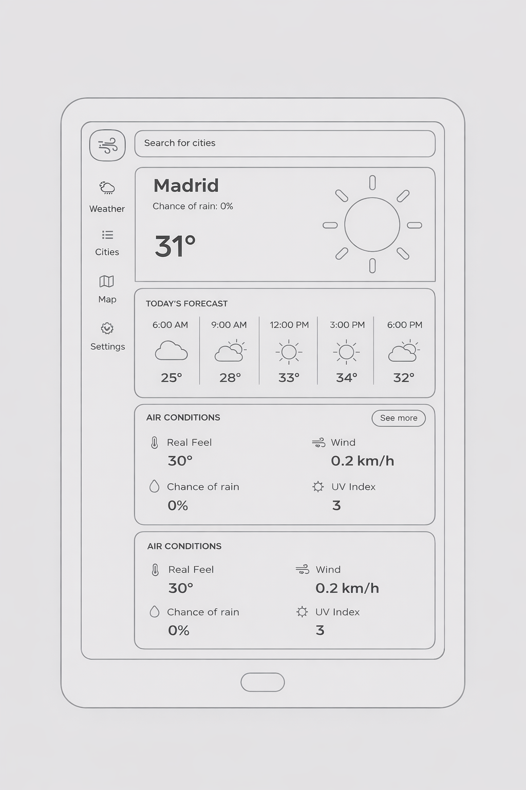
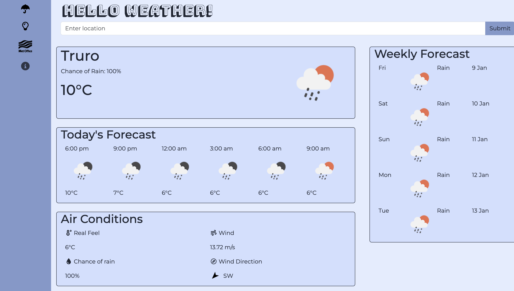
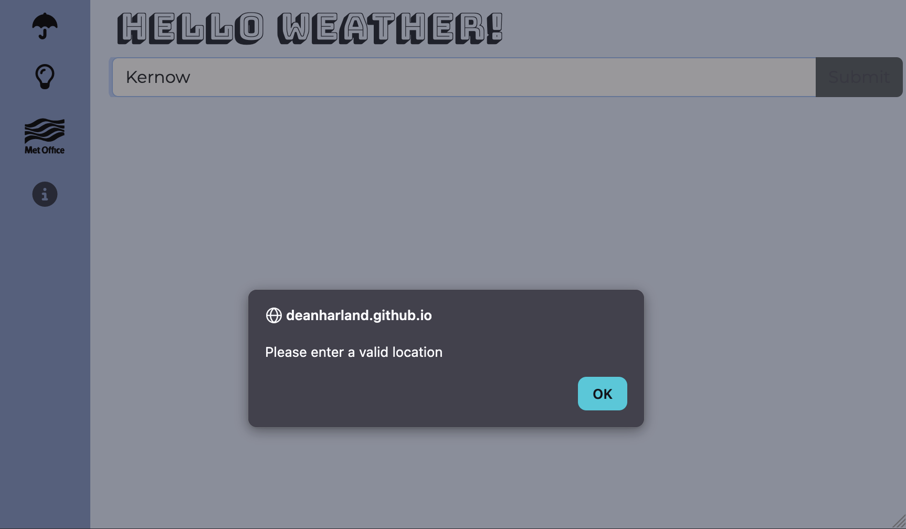
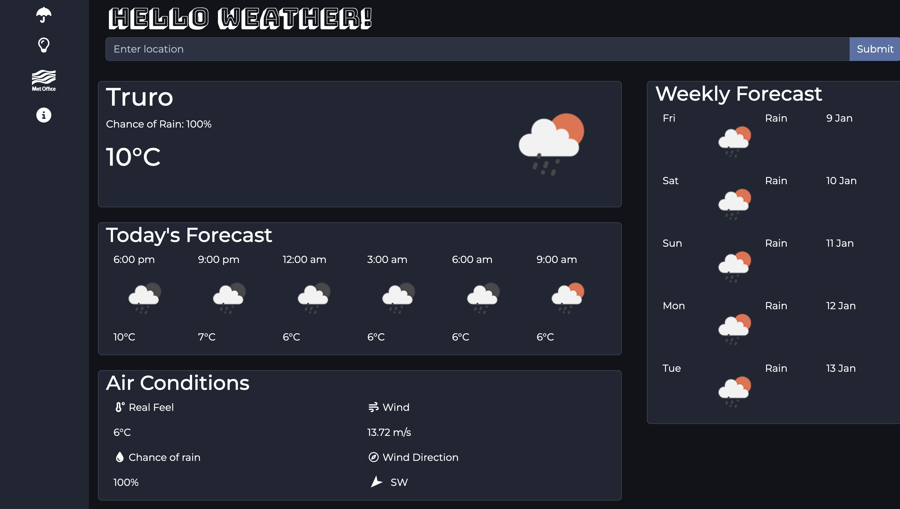
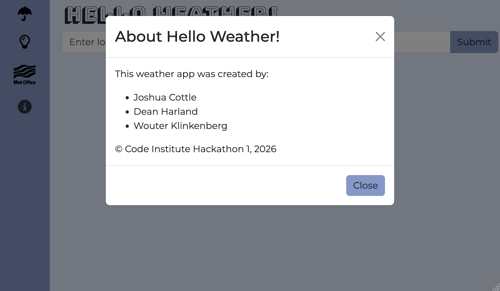

# ☂️ Hello Weather! - Weather Dashboard App

A responsive weather dashboard built using HTML, CSS, and JavaScript as part of our Web Development Bootcamp Hackathon 1.
The app allows users to search for cities and view current weather conditions, hourly forecasts, and a 5-day forecast in a clean, modern interface.

---

## 📸 Preview



---

## 📂 Project Structure

```
weather-app/
│
├── index.html
├── assets/
│   ├── css/
│   │   └── style.css
│   ├── js/
│   │   └── script.js
│   └── images/
└── README.md
```

---

## 🧩 User Stories

-   Users can search for a city to view its weather
-   Users can see current temperature and conditions
-   Users can view hourly and 7-day forecasts
-   Users receive feedback for invalid searches
-   Users can access the app on any device

(See GitHub Issues for the full user story list)

---

## Wireframes

<div style="display: flex; flex-wrap: wrap; gap: 12px; align-items: flex-start;">
    
    
</div>
<br>
<div>
    
</div>

---

## 🎨 Design

-   Friendly, high-contrast palette with a light default theme and a persisted dark mode for comfortable night use.
-   Bold title face (Bungee Shade) paired with Montserrat body text for clear hierarchy and readability.
-   Card-based layout with subtle borders and rounding to separate sections without heavy chrome.
-   Fixed sidebar nav on wider screens and stacked layout on mobile to keep controls reachable and legible.
-   Iconography (Font Awesome) and a rotating wind arrow to make weather signals instantly scannable.

---

## 🚀 Features



-   Searchbar to search for weather by city name (activated by submit button or enter key)
-   View current temperature and weather condition
-   View hourly forecast for the current day
-   View 5-day weather forecast
-   View additional air conditions:
    -   Real feel temperature
    -   Wind speed
    -   Chance of rain
    -   Wind direction
-   Fully responsive layout (mobile, tablet and desktop)and sidebar nav on wider screens.
-   Error handling for emtpy seach bar or invalid city searches
    
-   Lazy display: main and weekly forecast containers stay hidden until a successful lookup, keeping the UI clean.
-   Wind direction visualized with a rotating arrow
-   Dark mode toggle converting site into dark mode (persisting via localStorage)
    
-   External Met Office link in navbar
-   About modal with team info.
    

---

## 🔮 Future Features

-   Previous searched cities saved in navbar
-   Geolocation quick-start to auto-load local weather on first visit
-   Unit toggle (°C/°F and m/s → mph) persisted per user
-   Severe weather alerts banner with dismissal and learn-more links

---

## 🛠️ Technologies Used

| Technology             | Purpose                                             |
| ---------------------- | --------------------------------------------------- |
| **HTML5**              | Semantic structure and content                      |
| **CSS**                | Custom styling, CSS variables, media queries        |
| **JavaScript (ES6)**   | DOM manipulation and API handling                   |
| **OpenWeatherMap API** | to retrieve real-time weather data                  |
| **Bootstrap 5.3.8**    | Responsive grid, navbar, accordion, modal, carousel |
| **Font Awesome**       | Social media icons                                  |
| **Google Fonts**       | Poppins and Lora typefaces                          |
| **Git**                | Version control                                     |
| **GitHub**             | Repository hosting                                  |
| **GitHub Pages**       | Deployment and hosting                              |

---

## Deployment Procedure

This project is deployed using **GitHub Pages**. The steps to deploy are as follows:

-   In the GitHub repository, navigate to the Settings tab
-   From the source section drop-down menu, select the Master Branch
-   Once the master branch has been selected, the page will be automatically refreshed with a detailed ribbon display to indicate the successful deployment.

The live site can be found at: https://wouter-codes.github.io/calm-compass/

---

## 🧪 Testing

### Device Testing

Responsive design was tested on the following devices:

| Device        | Screen Size | Result |
| ------------- | ----------- | ------ |
| iPhone SE     | 375px       | Pass   |
| iPhone 12 Pro | 390px       | Pass   |
| iPad          | 768px       | Pass   |
| iPad Pro      | 1024px      | Pass   |
| Desktop       | 1920px      | Pass   |

### Validator Testing

**HTML** — No errors were returned when passing through the official W3C validator

**CSS** — No errors were found when passing through the official (Jigsaw) validator

**Lighthouse report** — No major errors found, 94% or higher scores across the board


## 💡 Credits

### Images

-   Wireframes created with the help of OpenAI
-   Met Office image from the official Met Office brand assets

### Code

-   **Mark Briscoe's weather app:** learnt how to use API following his example in his [weather app](https://github.com/mbriscoe/WeatherApp)
-   **Bootstrap 5 Documentation:** Navbar, accordion, modal, and carousel components adapted from [Bootstrap 5 Docs](https://getbootstrap.com/docs/5.3/)
-   **OpenWeatherMap API:** to retrieve real-time weather data, using the free API available: [5 day weather forecast](https://openweathermap.org/)
-   **Font Awesome:** Icons sourced from [Font Awesome](https://fontawesome.com/)
-   **Google Fonts:** Typography from [Google Fonts](https://fonts.google.com/)

## AI Assistance

This project was developed with assistance from **GitHub Copilot** (Claude), **OpenAI**, and **Gemini** for:

-   Drafting and refining README copy (design, features, credits, and future ideas)
-   Implementing dark-mode persistence and hover styling fixes
-   Suggesting UI/UX tweaks (hidden containers until search, rotating wind arrow)
-   Help with responsive layout of navbar
-   Debugging issues

All AI-generated code was reviewed, tested, and adapted to fit the project requirements.

## 👥 Team

This project was built by a team of 4 developers as part of a collaborative hackathon.

-   Joshua Anthony Cottle
-   Wouter Klinkenberg
-   Dean Harland

---

## 📄 License

This project is for educational purposes only as part of a bootcamp hackathon.
